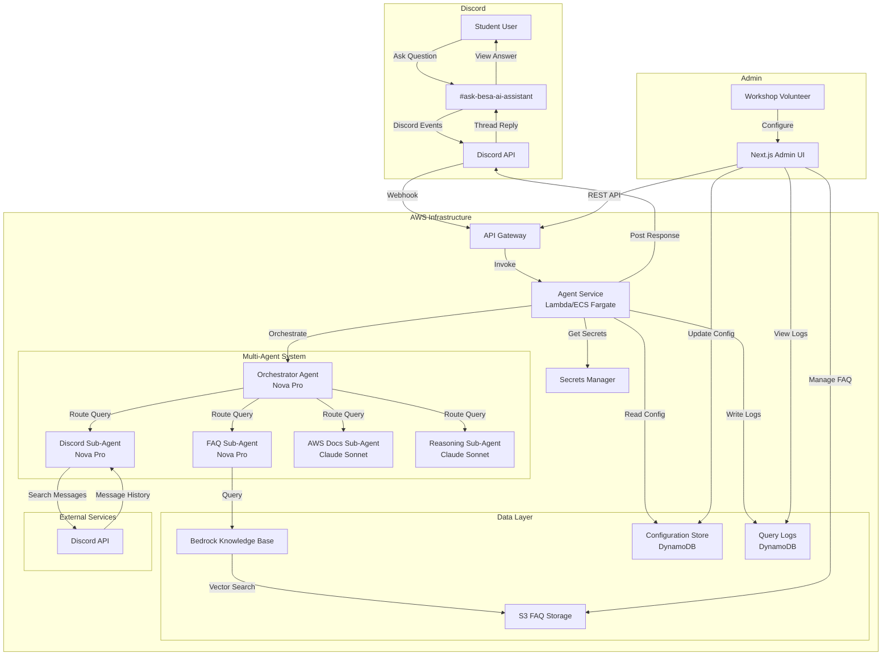
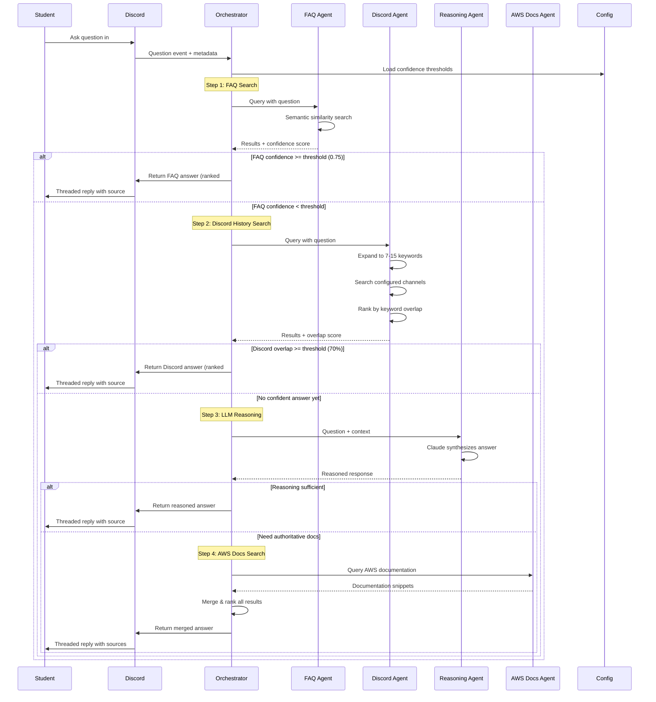
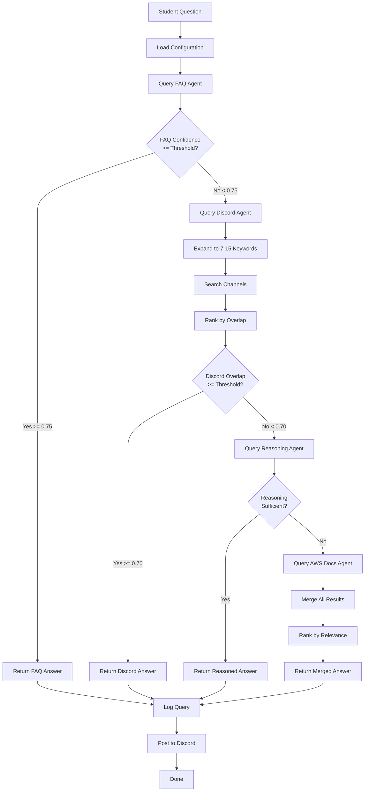
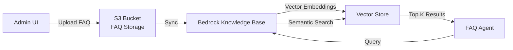
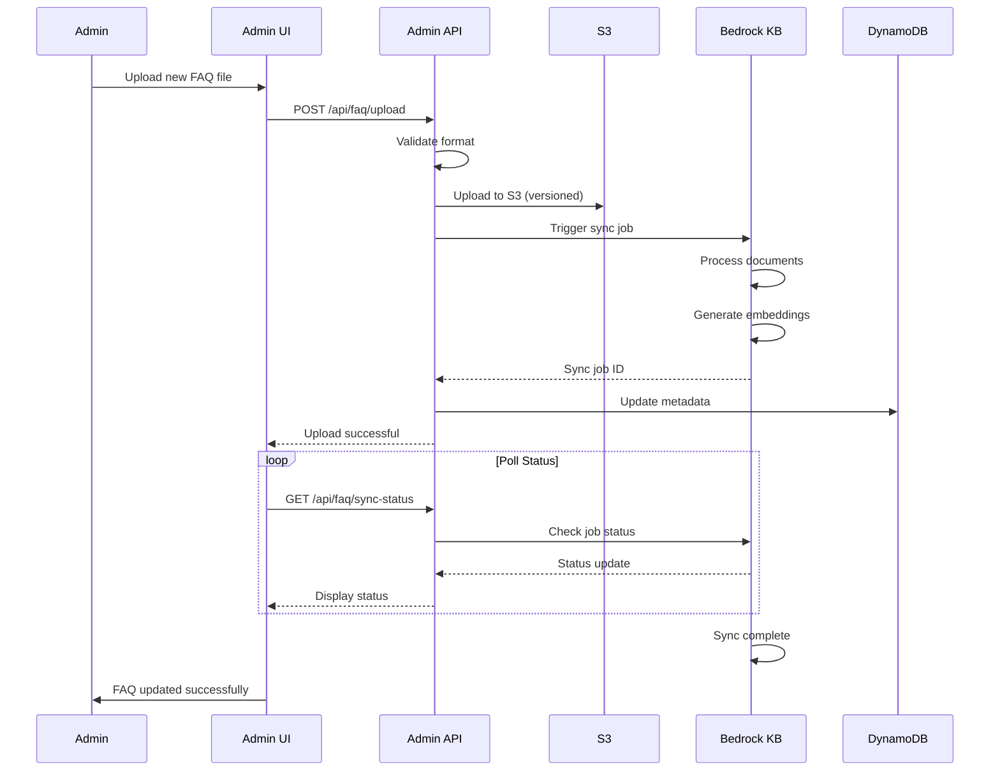

# Design Document: AWS Workshop Discord AI Assistant

## Overview

The AWS Workshop Discord AI Assistant is an intelligent, multi-agent chatbot system designed to support students during AWS workshops by providing instant, contextual answers to their questions. The system operates as a smart teaching assistant within Discord, leveraging a confidence-ranked waterfall search strategy across multiple knowledge sources: FAQ knowledge base, Discord channel history, LLM reasoning, and AWS documentation (via Claude's built-in knowledge). Built on AWS Strands Agents framework with a multi-model approach, the system uses Amazon Bedrock Nova Pro for lightweight tasks (intent classification, query expansion, keyword generation) and Claude Sonnet for complex reasoning and AWS documentation context, optimizing both cost and response quality.

The assistant is configurable through a Next.js admin interface where workshop volunteers can manage FAQ content, select which Discord channels to search, tune confidence thresholds for each knowledge source, and adjust query expansion parameters. Students interact with the bot through a dedicated Discord channel or slash commands, receiving threaded responses that clearly indicate the source of each answer (FAQ, Discord history, AWS docs, or LLM reasoning), ensuring transparency and building trust in the system's recommendations.

**MVP Architecture Decisions**:
- **Hosting**: AWS Lambda for simplicity and auto-scaling (migration path to ECS Fargate if needed)
- **Discord Integration**: Direct Discord API access via discord.py library (no MCP layer)
- **AWS Documentation**: Claude Sonnet's built-in AWS knowledge (no external docs integration)
- **Query Expansion**: Amazon Bedrock Nova Pro with 7-15 keyword range
- **Cost Management**: $100/month budget with aggressive caching (expected $60-80/month)
- **Language Support**: English-only for MVP
- **Testing**: 60% unit test coverage, prioritize integration tests
- **Error Handling**: Graceful degradation with source fallback

## Architecture

### System Architecture Overview



### Query Flow Sequence



## Components and Interfaces

### Component 1: Orchestrator Agent

**Purpose**: Central coordinator that implements the confidence-ranked waterfall logic, routes queries to appropriate sub-agents, evaluates confidence thresholds, and merges results.

**Model**: Amazon Bedrock Nova Pro

**Interface**:
```python
class OrchestratorAgent:
    def handle_question(self, question: str, context: QuestionContext) -> BotResponse:
        """
        Main entry point for processing student questions.
        
        Args:
            question: Raw question text from student
            context: Discord metadata (channel, user, thread)
            
        Returns:
            BotResponse with ranked answers and source attribution
        """
        pass
    
    def evaluate_confidence(self, results: List[SourceResult], source_type: SourceType) -> bool:
        """
        Evaluate if results from a source meet confidence threshold.
        
        Args:
            results: Results from a sub-agent
            source_type: Which source (FAQ, Discord, etc.)
            
        Returns:
            True if confidence threshold met, False to continue waterfall
        """
        pass
    
    def merge_and_rank(self, all_results: List[SourceResult]) -> List[RankedAnswer]:
        """
        Merge results from multiple sources and rank by relevance.
        
        Args:
            all_results: Results from all queried sources
            
        Returns:
            Ranked list of answers with source attribution
        """
        pass
```

**Responsibilities**:
- Receive incoming questions from Discord webhook
- Load configuration (thresholds, channel list, expansion depth)
- Execute waterfall logic: FAQ → Discord → Reasoning → AWS Docs
- Evaluate confidence at each step
- Short-circuit when high-confidence answer found
- Merge and rank results when multiple sources return data
- Format final response with source attribution
- Log query and response for admin review


### Component 2: FAQ Sub-Agent

**Purpose**: Performs semantic similarity search against the vectorized FAQ knowledge base using Bedrock Knowledge Bases.

**Model**: Amazon Bedrock Nova Pro

**Interface**:
```python
class FAQAgent:
    def search_faq(self, question: str, threshold: float) -> FAQResult:
        """
        Search FAQ knowledge base using semantic similarity.
        
        Args:
            question: Student's question
            threshold: Minimum similarity score (default 0.75)
            
        Returns:
            FAQResult with matched entries and confidence scores
        """
        pass
    
    def get_top_matches(self, question: str, top_k: int = 3) -> List[FAQEntry]:
        """
        Retrieve top K FAQ entries by similarity.
        
        Args:
            question: Student's question
            top_k: Number of results to return
            
        Returns:
            List of FAQ entries sorted by similarity score
        """
        pass
```

**Responsibilities**:
- Query Bedrock Knowledge Base with student question
- Retrieve semantically similar FAQ entries
- Score results by similarity (0.0 to 1.0)
- Return top matches with confidence scores
- Handle empty results gracefully

**Data Model**:
```python
class FAQEntry:
    id: str
    question: str
    answer: str
    category: str
    last_updated: datetime
    
class FAQResult:
    entries: List[FAQEntry]
    confidence_score: float  # Highest similarity score
    source: str = "FAQ"
```

### Component 3: Discord Sub-Agent

**Purpose**: Searches Discord channel history using query expansion and keyword-based ranking to find relevant past discussions via direct Discord API integration.

**Model**: Amazon Bedrock Nova Pro

**Interface**:
```python
class DiscordAgent:
    def search_discord_history(
        self, 
        question: str, 
        channels: List[str],
        expansion_depth: int,
        overlap_threshold: float
    ) -> DiscordResult:
        """
        Search Discord channels with query expansion using Discord API.
        
        Args:
            question: Student's question
            channels: List of channel IDs to search
            expansion_depth: Number of keywords to generate (7-15)
            overlap_threshold: Minimum keyword overlap % (default 0.70)
            
        Returns:
            DiscordResult with matched messages and overlap scores
        """
        pass
    
    def expand_query(self, question: str, depth: int) -> List[str]:
        """
        Expand question into semantically related keywords.
        
        Args:
            question: Original question
            depth: Number of keywords to generate
            
        Returns:
            List of expanded keywords/phrases
        """
        pass
    
    def rank_by_overlap(
        self, 
        messages: List[DiscordMessage], 
        keywords: List[str]
    ) -> List[RankedMessage]:
        """
        Rank messages by keyword overlap percentage.
        
        Args:
            messages: Retrieved Discord messages
            keywords: Expanded keyword list
            
        Returns:
            Messages ranked by overlap score
        """
        pass
```


**Responsibilities**:
- Expand student question into 7-15 related keywords using Nova Pro
- Search configured Discord channels via Discord API (discord.py library)
- Calculate keyword overlap for each retrieved message
- Rank messages by overlap percentage
- Return top matches with source links (message URLs)
- Handle thread context and conversation continuity

**Implementation Note**: Uses discord.py library for direct API access. No MCP layer in MVP - can be added in Phase 2 if multi-platform support needed.

**Data Model**:
```python
class DiscordMessage:
    message_id: str
    channel_id: str
    author: str
    content: str
    timestamp: datetime
    thread_id: Optional[str]
    url: str
    
class RankedMessage:
    message: DiscordMessage
    overlap_score: float  # 0.0 to 1.0
    matched_keywords: List[str]
    
class DiscordResult:
    messages: List[RankedMessage]
    confidence_score: float  # Highest overlap score
    source: str = "Discord History"
    keywords_used: List[str]
```

### Component 4: AWS Docs Sub-Agent

**Purpose**: Provides AWS documentation context using Claude Sonnet's built-in AWS knowledge when other sources are insufficient.

**Model**: Amazon Bedrock Claude Sonnet

**Interface**:
```python
class AWSDocsAgent:
    def get_aws_documentation_context(
        self, 
        question: str, 
        context: str = ""
    ) -> DocsResult:
        """
        Retrieve AWS documentation context using Claude's built-in knowledge.
        
        Args:
            question: Student's question
            context: Optional context from previous search attempts
            
        Returns:
            DocsResult with relevant AWS documentation information
        """
        pass
    
    def extract_service_names(self, question: str) -> List[str]:
        """
        Extract AWS service names mentioned in the question.
        
        Args:
            question: Student's question
            
        Returns:
            List of AWS service names (e.g., ["Lambda", "DynamoDB"])
        """
        pass
```

**Responsibilities**:
- Leverage Claude Sonnet's extensive AWS knowledge from training data
- Provide authoritative AWS documentation context
- Extract relevant AWS service information
- Return documentation snippets with conceptual explanations
- Handle service-specific questions

**Implementation Note**: MVP uses Claude's built-in AWS knowledge. Phase 2 can add Bedrock Knowledge Base with official AWS docs if authoritative source links become critical.

**Data Model**:
```python
class DocSnippet:
    title: str
    content: str
    service: str  # e.g., "Lambda", "DynamoDB"
    relevance_score: float
    
class DocsResult:
    snippets: List[DocSnippet]
    confidence_score: float
    source: str = "AWS Documentation (Claude Knowledge)"
```


### Component 5: Reasoning Sub-Agent

**Purpose**: Synthesizes answers using Claude Sonnet's AWS knowledge when no confident answer found in knowledge sources.

**Model**: Amazon Bedrock Claude Sonnet

**Interface**:
```python
class ReasoningAgent:
    def synthesize_answer(
        self, 
        question: str, 
        partial_results: List[SourceResult]
    ) -> ReasoningResult:
        """
        Generate reasoned answer using Claude's AWS knowledge.
        
        Args:
            question: Student's question
            partial_results: Low-confidence results from other sources
            
        Returns:
            ReasoningResult with synthesized answer
        """
        pass
    
    def validate_reasoning(self, answer: str, question: str) -> bool:
        """
        Self-validate that the reasoning is sound and relevant.
        
        Args:
            answer: Generated answer
            question: Original question
            
        Returns:
            True if answer is relevant and well-reasoned
        """
        pass
```

**Responsibilities**:
- Invoked only when FAQ, Discord, and Docs return low-confidence results
- Synthesize answer using Claude Sonnet's AWS expertise
- Consider partial results from other sources as context
- Provide step-by-step reasoning when appropriate
- Flag when answer requires verification
- Most expensive agent — use sparingly

**Data Model**:
```python
class ReasoningResult:
    answer: str
    reasoning_steps: List[str]
    confidence_level: str  # "high", "medium", "low"
    requires_verification: bool
    source: str = "AI Reasoning"
```

### Component 6: Discord Integration Service

**Purpose**: Handles Discord API interactions, webhook processing, and message posting.

**Interface**:
```python
class DiscordIntegrationService:
    def handle_webhook(self, event: DiscordEvent) -> None:
        """
        Process incoming Discord webhook events.
        
        Args:
            event: Discord event (message, slash command, etc.)
        """
        pass
    
    def post_threaded_response(
        self, 
        channel_id: str, 
        message_id: str, 
        response: BotResponse
    ) -> None:
        """
        Post bot response as a threaded reply.
        
        Args:
            channel_id: Discord channel ID
            message_id: Original message ID to reply to
            response: Formatted bot response
        """
        pass
    
    def format_response(self, ranked_answers: List[RankedAnswer]) -> str:
        """
        Format ranked answers with source attribution for Discord.
        
        Args:
            ranked_answers: Answers ranked by relevance
            
        Returns:
            Formatted Discord message with embeds
        """
        pass
```

**Responsibilities**:
- Listen for Discord events via webhook
- Parse slash commands and channel messages
- Extract question text and metadata
- Invoke orchestrator agent
- Format response with source attribution
- Post threaded replies to Discord
- Handle rate limiting and retries

### Component 7: Admin UI Backend

**Purpose**: REST API for the Next.js admin interface to manage configuration and view logs.

**Interface**:
```python
class AdminAPIHandler:
    def get_configuration(self) -> Configuration:
        """Retrieve current bot configuration"""
        pass
    
    def update_configuration(self, config: Configuration) -> bool:
        """Update bot configuration"""
        pass
    
    def upload_faq(self, faq_content: str, format: str) -> bool:
        """Upload FAQ content to S3 and trigger KB sync"""
        pass
    
    def get_query_logs(
        self, 
        start_date: datetime, 
        end_date: datetime,
        filters: Optional[LogFilters]
    ) -> List[QueryLog]:
        """Retrieve query logs for admin review"""
        pass
    
    def get_analytics(self, time_range: str) -> Analytics:
        """Get bot usage analytics"""
        pass
```

**Responsibilities**:
- Serve configuration data to admin UI
- Persist configuration updates to DynamoDB
- Handle FAQ uploads to S3
- Trigger Bedrock Knowledge Base sync after FAQ updates
- Provide query logs with filtering
- Generate usage analytics


### Component 8: Admin UI Frontend

**Purpose**: Next.js web application for workshop volunteers to configure and monitor the bot.

**Interface** (React Components):
```typescript
interface AdminUIComponents {
  // Configuration Management
  ConfigurationPanel: React.FC<{
    config: Configuration
    onUpdate: (config: Configuration) => Promise<void>
  }>
  
  // FAQ Management
  FAQManager: React.FC<{
    onUpload: (file: File) => Promise<void>
    currentFAQ: FAQMetadata
  }>
  
  // Channel Configuration
  ChannelSelector: React.FC<{
    availableChannels: DiscordChannel[]
    selectedChannels: string[]
    onChange: (channels: string[]) => void
  }>
  
  // Threshold Configuration
  ThresholdEditor: React.FC<{
    thresholds: ThresholdConfig
    onChange: (thresholds: ThresholdConfig) => void
  }>
  
  // Query Logs Viewer
  QueryLogsTable: React.FC<{
    logs: QueryLog[]
    filters: LogFilters
    onFilterChange: (filters: LogFilters) => void
  }>
  
  // Analytics Dashboard
  AnalyticsDashboard: React.FC<{
    analytics: Analytics
    timeRange: string
  }>
}
```

**Responsibilities**:
- Provide intuitive UI for configuration management
- Allow FAQ upload (CSV, JSON, or Markdown)
- Display available Discord channels for selection
- Enable threshold tuning with real-time preview
- Configure query expansion depth (7-15 keywords)
- Show query logs with filtering and search
- Display analytics: questions per day, source distribution, response times
- Handle authentication for volunteer access

## Data Models

### Core Data Types

```python
class QuestionContext:
    """Metadata about the question being asked"""
    channel_id: str
    channel_name: str
    user_id: str
    username: str
    message_id: str
    timestamp: datetime
    thread_id: Optional[str]

class SourceResult:
    """Generic result from any knowledge source"""
    source_type: SourceType  # FAQ, Discord, Docs, Reasoning, Search
    content: str
    confidence_score: float
    metadata: Dict[str, Any]
    source_url: Optional[str]

class RankedAnswer:
    """Final ranked answer with attribution"""
    rank: int
    content: str
    source: str
    confidence_score: float
    source_url: Optional[str]
    matched_keywords: Optional[List[str]]

class BotResponse:
    """Complete response to send to Discord"""
    ranked_answers: List[RankedAnswer]
    total_sources_queried: int
    response_time_ms: int
    waterfall_stopped_at: str  # Which step provided answer
```


### Configuration Schema

```python
class Configuration:
    """Bot configuration stored in DynamoDB"""
    config_id: str = "primary"
    
    # Confidence Thresholds
    faq_similarity_threshold: float = 0.75
    discord_overlap_threshold: float = 0.70
    
    # Query Expansion
    query_expansion_depth: int = 10  # 7-15 range
    
    # Discord Settings
    searchable_channels: List[str]  # Channel IDs
    bot_channel_id: str  # Where bot responds
    
    # Feature Flags
    enable_reasoning_agent: bool = True
    enable_aws_docs_agent: bool = True
    enable_online_search: bool = False  # Phase 2 feature
    
    # Rate Limiting
    max_queries_per_user_per_hour: int = 20
    
    # Logging
    log_all_queries: bool = True
    log_retention_days: int = 90
    
    last_updated: datetime
    updated_by: str

class ThresholdConfig:
    """Threshold configuration for admin UI"""
    faq_threshold: float
    discord_threshold: float
    description: str
    recommended: bool

class FAQMetadata:
    """Metadata about FAQ knowledge base"""
    s3_key: str
    last_updated: datetime
    entry_count: int
    kb_sync_status: str  # "synced", "syncing", "failed"
    kb_id: str
```

### Logging Schema

```python
class QueryLog:
    """Log entry for each question processed"""
    log_id: str
    timestamp: datetime
    
    # Question Details
    question: str
    user_id: str
    username: str
    channel_id: str
    
    # Processing Details
    sources_queried: List[str]
    waterfall_stopped_at: str
    response_time_ms: int
    
    # Results
    answer_provided: str
    answer_source: str
    confidence_score: float
    
    # Agent Costs (for monitoring)
    nova_invocations: int
    claude_invocations: int
    
    # Feedback (future)
    user_feedback: Optional[str]  # thumbs up/down

class Analytics:
    """Aggregated analytics for dashboard"""
    time_range: str
    total_questions: int
    questions_by_source: Dict[str, int]
    avg_response_time_ms: float
    avg_confidence_score: float
    unique_users: int
    peak_usage_hour: int
    cost_estimate: float
```

## Waterfall Logic and Confidence Evaluation

### Waterfall Decision Tree




### Confidence Evaluation Rules

**FAQ Confidence**:
- Based on semantic similarity score from Bedrock Knowledge Base
- Score range: 0.0 to 1.0
- Default threshold: 0.75
- High confidence (>= 0.75): Return immediately, stop waterfall
- Low confidence (< 0.75): Continue to Discord search

**Discord Confidence**:
- Based on keyword overlap percentage
- Calculation: (matched_keywords / total_keywords) * 100
- Score range: 0.0 to 1.0 (percentage as decimal)
- Default threshold: 0.70 (70% overlap)
- High confidence (>= 0.70): Return immediately, stop waterfall
- Low confidence (< 0.70): Continue to reasoning

**Reasoning Sufficiency**:
- Evaluated by Reasoning Agent itself
- Criteria: Answer is complete, relevant, and well-reasoned
- If sufficient: Return reasoned answer
- If insufficient or needs authoritative source: Continue to AWS Docs

**Multi-Source Merging**:
- When multiple sources return results below individual thresholds
- Combine all results and rank by relevance score
- Present top 3 answers with clear source attribution
- User sees best answer from each source

## Query Expansion Design

### Expansion Strategy

The Discord Sub-Agent uses Nova Pro to expand the student's question into 7-15 semantically related keywords before searching Discord history. This maximizes recall by capturing different ways the same concept might be expressed in past discussions.

### Expansion Prompt Template

```python
EXPANSION_PROMPT = """
You are a keyword expansion assistant for searching Discord chat history.

Given a student's question about AWS, generate {depth} semantically related keywords and phrases that would help find relevant past discussions.

Rules:
1. Include the core concepts from the question
2. Add common synonyms and related terms
3. Include AWS service names if relevant
4. Add common error messages or symptoms if applicable
5. Include both technical terms and casual language
6. Keep each keyword/phrase concise (1-4 words)
7. Return exactly {depth} keywords

Question: {question}

Return keywords as a JSON array:
["keyword1", "keyword2", ...]
"""
```

### Expansion Example

**Input Question**: "How do I fix Lambda timeout errors when connecting to RDS?"

**Expanded Keywords (depth=10)**:
```json
[
  "Lambda timeout",
  "RDS connection",
  "database timeout",
  "VPC configuration",
  "security group",
  "Lambda RDS",
  "connection timeout",
  "cold start",
  "ENI attachment",
  "subnet configuration"
]
```

### Keyword Overlap Calculation

```python
def calculate_overlap(message: str, keywords: List[str]) -> float:
    """
    Calculate keyword overlap score for a Discord message.
    
    Args:
        message: Discord message content
        keywords: Expanded keyword list
        
    Returns:
        Overlap score (0.0 to 1.0)
    """
    message_lower = message.lower()
    matched = 0
    
    for keyword in keywords:
        if keyword.lower() in message_lower:
            matched += 1
    
    overlap_score = matched / len(keywords)
    return overlap_score
```

### Fallback Behavior

If query expansion fails or returns insufficient keywords:
1. Use original question as single keyword
2. Add AWS service names mentioned in question
3. Minimum 3 keywords required for search
4. Log expansion failure for admin review


## FAQ Knowledge Base Setup

### Architecture



### FAQ Document Format

The system supports multiple FAQ formats for flexibility:

**CSV Format**:
```csv
category,question,answer,last_updated
Lambda,How do I increase Lambda timeout?,Go to Lambda console > Configuration > General configuration > Edit > Set timeout up to 15 minutes,2024-01-15
DynamoDB,What is the difference between scan and query?,Query requires partition key and is more efficient. Scan reads entire table and is slower.,2024-01-15
```

**JSON Format**:
```json
{
  "faqs": [
    {
      "id": "faq-001",
      "category": "Lambda",
      "question": "How do I increase Lambda timeout?",
      "answer": "Go to Lambda console > Configuration > General configuration > Edit > Set timeout up to 15 minutes",
      "tags": ["lambda", "timeout", "configuration"],
      "last_updated": "2024-01-15"
    }
  ]
}
```

**Markdown Format**:
```markdown
# AWS Workshop FAQ

## Lambda

### How do I increase Lambda timeout?
Go to Lambda console > Configuration > General configuration > Edit > Set timeout up to 15 minutes

### What causes Lambda cold starts?
Cold starts occur when Lambda creates a new execution environment...
```

### Ingestion Pipeline

```python
class FAQIngestionPipeline:
    def upload_faq(self, file: File, format: str) -> IngestionResult:
        """
        Upload FAQ file and trigger Knowledge Base sync.
        
        Steps:
        1. Validate file format
        2. Parse and normalize FAQ entries
        3. Upload to S3 with versioning
        4. Trigger Bedrock KB sync job
        5. Monitor sync status
        6. Update metadata in DynamoDB
        
        Args:
            file: FAQ file (CSV, JSON, or Markdown)
            format: File format identifier
            
        Returns:
            IngestionResult with sync job ID and status
        """
        pass
    
    def validate_faq_format(self, content: str, format: str) -> bool:
        """Validate FAQ file structure"""
        pass
    
    def normalize_entries(self, raw_entries: List[Dict]) -> List[FAQEntry]:
        """Convert to standard FAQEntry format"""
        pass
    
    def trigger_kb_sync(self, s3_key: str) -> str:
        """Start Bedrock Knowledge Base sync job"""
        pass
    
    def monitor_sync_status(self, job_id: str) -> SyncStatus:
        """Poll sync job until complete"""
        pass
```

### Update Flow




### Similarity Search Tuning

**Bedrock Knowledge Base Configuration**:
- Embedding Model: Amazon Titan Embeddings G1 - Text
- Vector Dimensions: 1536
- Similarity Metric: Cosine similarity
- Top K Results: 3 (configurable)
- Minimum Score: 0.75 (configurable via admin UI)

**Search Parameters**:
```python
class FAQSearchParams:
    query: str
    top_k: int = 3
    min_score: float = 0.75
    filters: Optional[Dict[str, str]] = None  # e.g., {"category": "Lambda"}
```

**Optimization Strategies**:
- Chunk FAQ entries by question-answer pairs (not by document)
- Include category and tags in metadata for filtering
- Use question text as primary searchable content
- Store full answer in metadata for retrieval
- Regular reindexing when FAQ grows beyond 100 entries

## Discord API Integration

### Discord Bot Setup

**Bot Permissions Required**:
- Read Messages/View Channels
- Send Messages
- Send Messages in Threads
- Embed Links
- Read Message History
- Use Slash Commands

**Bot Configuration**:
```python
class DiscordBotConfig:
    bot_token: str  # Stored in Secrets Manager
    application_id: str
    guild_id: str  # Workshop Discord server
    bot_channel_id: str  # #ask-besa-ai-assistant
    searchable_channels: List[str]  # Configured via admin UI
    webhook_url: str  # For receiving events
    webhook_secret: str  # For signature verification
```

### Discord.py Library Integration

The system uses discord.py library for direct Discord API access:

```python
class DiscordAPIClient:
    def __init__(self, bot_token: str):
        self.client = discord.Client(intents=discord.Intents.default())
        self.bot_token = bot_token
    
    async def search_messages(
        self,
        channels: List[str],
        keywords: List[str],
        limit: int = 50,
        after: Optional[datetime] = None
    ) -> List[DiscordMessage]:
        """
        Search messages in specified channels using Discord API.
        
        Args:
            channels: List of channel IDs to search
            keywords: Keywords to search for
            limit: Max messages to return per channel
            after: Search messages after this timestamp (default: 90 days ago)
            
        Returns:
            List of matching Discord messages
        """
        messages = []
        for channel_id in channels:
            channel = await self.client.fetch_channel(channel_id)
            async for message in channel.history(limit=limit, after=after):
                if self._matches_keywords(message.content, keywords):
                    messages.append(self._to_discord_message(message))
        return messages
    
    def _matches_keywords(self, content: str, keywords: List[str]) -> bool:
        """Check if message content matches any keywords"""
        content_lower = content.lower()
        return any(keyword.lower() in content_lower for keyword in keywords)
    
    async def get_thread_context(
        self,
        message_id: str,
        thread_id: str
    ) -> ThreadContext:
        """
        Retrieve full thread context for a message.
        
        Args:
            message_id: Message ID
            thread_id: Thread ID
            
        Returns:
            ThreadContext with all messages in thread
        """
        thread = await self.client.fetch_channel(thread_id)
        messages = []
        async for message in thread.history(limit=100):
            messages.append(self._to_discord_message(message))
        return ThreadContext(messages=messages)
    
    async def post_message(
        self,
        channel_id: str,
        content: str,
        embeds: Optional[List[discord.Embed]] = None,
        reply_to: Optional[str] = None
    ) -> str:
        """
        Post a message to Discord.
        
        Args:
            channel_id: Target channel
            content: Message text
            embeds: Rich embeds for formatting
            reply_to: Message ID to reply to (creates thread)
            
        Returns:
            Posted message ID
        """
        channel = await self.client.fetch_channel(channel_id)
        
        if reply_to:
            reference_message = await channel.fetch_message(reply_to)
            message = await reference_message.reply(content=content, embeds=embeds)
        else:
            message = await channel.send(content=content, embeds=embeds)
        
        return str(message.id)
```

**Implementation Notes**:
- Uses discord.py v2.3.0 or later
- Implements connection pooling for API efficiency
- Handles rate limiting with exponential backoff
- Caches channel objects to reduce API calls
- No MCP layer in MVP - direct API access for simplicity and performance


### Message Search Strategy

**Search Flow**:
1. Discord Agent receives expanded keywords from query expansion
2. For each keyword, search configured channels via Discord API (discord.py)
3. Retrieve up to 50 messages per channel (configurable)
4. Filter messages from last 90 days (configurable)
5. Calculate keyword overlap for each message
6. Rank messages by overlap score
7. Return top 5 messages with context

**Thread Context Handling**:
- If a high-ranking message is part of a thread, retrieve full thread
- Include 2-3 messages before and after for context
- Preserve conversation flow in response
- Link to original thread for full discussion

### Response Formatting

**Discord Embed Format**:
```python
class BotResponseEmbed:
    title: str = "Answer from [Source]"
    description: str  # The actual answer
    color: int  # Color code by source (FAQ=blue, Discord=green, etc.)
    fields: List[EmbedField]
    footer: EmbedFooter
    timestamp: datetime

class EmbedField:
    name: str  # e.g., "Source", "Confidence", "Related Links"
    value: str
    inline: bool

class EmbedFooter:
    text: str  # e.g., "Answered in 1.2s | FAQ Match: 0.89"
    icon_url: Optional[str]
```

**Example Response**:
```
🤖 BESA AI Assistant

**Answer from FAQ** (Confidence: 0.89)
To increase Lambda timeout, go to Lambda console > Configuration > General configuration > Edit > Set timeout up to 15 minutes. Maximum timeout is 15 minutes (900 seconds).

**Related Discussion** (Confidence: 0.72)
@student123 asked a similar question yesterday:
"I had the same issue! Make sure your Lambda has enough timeout AND check your RDS security group..."
[View full thread →](https://discord.com/channels/...)

---
⏱️ Answered in 1.2s | 📚 Sources: FAQ, Discord History
```

### Slash Command Support

**Supported Commands**:
```
/ask [question]
  Ask the AI assistant a question
  
/ask-private [question]
  Ask a question with response sent as ephemeral (only you see it)
  
/faq [search]
  Search FAQ directly without full waterfall
  
/help
  Show bot usage instructions
```

**Command Handler**:
```python
class SlashCommandHandler:
    def handle_ask(self, interaction: Interaction, question: str) -> None:
        """Handle /ask command"""
        pass
    
    def handle_ask_private(self, interaction: Interaction, question: str) -> None:
        """Handle /ask-private command (ephemeral response)"""
        pass
    
    def handle_faq(self, interaction: Interaction, search: str) -> None:
        """Handle /faq command (FAQ-only search)"""
        pass
    
    def handle_help(self, interaction: Interaction) -> None:
        """Handle /help command"""
        pass
```

## Admin UI Specification

### Page Structure

```
/admin
  /dashboard          # Analytics and overview
  /configuration      # Bot settings and thresholds
  /faq                # FAQ management
  /channels           # Discord channel configuration
  /logs               # Query logs and history
  /analytics          # Detailed analytics
```


### Dashboard Page

**Components**:
- Quick stats: Total questions today, avg response time, top source
- Recent questions list (last 10)
- Source distribution pie chart
- Response time trend graph (last 7 days)
- System health indicators

**API Endpoints**:
```typescript
GET /api/dashboard/stats
Response: {
  today_questions: number
  avg_response_time_ms: number
  top_source: string
  system_health: "healthy" | "degraded" | "down"
}

GET /api/dashboard/recent-questions?limit=10
Response: {
  questions: QueryLog[]
}
```

### Configuration Page

**Sections**:

1. **Confidence Thresholds**
   - FAQ Similarity Threshold (slider: 0.5 - 1.0, default 0.75)
   - Discord Overlap Threshold (slider: 0.5 - 1.0, default 0.70)
   - Real-time preview of impact on recent queries

2. **Query Expansion**
   - Expansion Depth (slider: 7 - 15, default 10)
   - Preview: Show expanded keywords for sample question

3. **Feature Flags**
   - Enable/disable Reasoning Agent
   - Enable/disable AWS Docs Agent
   - Enable/disable Online Search Agent

4. **Rate Limiting**
   - Max queries per user per hour (input: 1-100, default 20)

**API Endpoints**:
```typescript
GET /api/configuration
Response: Configuration

PUT /api/configuration
Request: Configuration
Response: { success: boolean, message: string }

POST /api/configuration/preview-expansion
Request: { question: string, depth: number }
Response: { keywords: string[] }
```

### FAQ Management Page

**Features**:
- Upload FAQ file (drag-and-drop or file picker)
- Format selection: CSV, JSON, Markdown
- Current FAQ metadata display (entry count, last updated)
- Sync status indicator
- Preview FAQ entries in table
- Download current FAQ

**API Endpoints**:
```typescript
POST /api/faq/upload
Request: FormData with file
Response: { 
  success: boolean, 
  sync_job_id: string,
  message: string 
}

GET /api/faq/sync-status?job_id={id}
Response: {
  status: "pending" | "syncing" | "completed" | "failed"
  progress: number  // 0-100
  message: string
}

GET /api/faq/metadata
Response: FAQMetadata

GET /api/faq/entries?page=1&limit=50
Response: {
  entries: FAQEntry[]
  total: number
  page: number
}

GET /api/faq/download
Response: File download (current FAQ in selected format)
```

### Channel Configuration Page

**Features**:
- List all Discord channels in the server
- Multi-select checkboxes for searchable channels
- Preview: Show recent messages from selected channels
- Bot channel selection (where bot responds)
- Save configuration

**API Endpoints**:
```typescript
GET /api/discord/channels
Response: {
  channels: DiscordChannel[]
}

GET /api/discord/channel-preview?channel_id={id}&limit=10
Response: {
  messages: DiscordMessage[]
}

PUT /api/configuration/channels
Request: {
  searchable_channels: string[]
  bot_channel_id: string
}
Response: { success: boolean }
```


### Query Logs Page

**Features**:
- Searchable table of all queries
- Filters: Date range, source, user, confidence range
- Sort by: timestamp, response time, confidence
- Export logs to CSV
- Click to view full query details

**Columns**:
- Timestamp
- Question (truncated, click to expand)
- User
- Source
- Confidence
- Response Time
- Status (success/error)

**API Endpoints**:
```typescript
GET /api/logs/queries?start_date={date}&end_date={date}&source={source}&page=1&limit=50
Response: {
  logs: QueryLog[]
  total: number
  page: number
}

GET /api/logs/query/{log_id}
Response: QueryLog (full details)

GET /api/logs/export?start_date={date}&end_date={date}
Response: CSV file download
```

### Analytics Page

**Visualizations**:
- Questions per day (line chart, last 30 days)
- Source distribution (pie chart)
- Confidence score distribution (histogram)
- Response time percentiles (box plot)
- Top users by question count (bar chart)
- Peak usage hours (heatmap)
- Cost breakdown by agent (pie chart)

**API Endpoints**:
```typescript
GET /api/analytics/overview?time_range={range}
Response: Analytics

GET /api/analytics/questions-per-day?days=30
Response: {
  dates: string[]
  counts: number[]
}

GET /api/analytics/source-distribution?time_range={range}
Response: {
  sources: { [key: string]: number }
}

GET /api/analytics/cost-breakdown?time_range={range}
Response: {
  nova_cost: number
  claude_cost: number
  total_cost: number
  invocations: {
    nova: number
    claude: number
  }
}
```

### Authentication

**Strategy**: AWS Cognito for volunteer authentication

**User Roles**:
- Admin: Full access to all features
- Viewer: Read-only access to logs and analytics

**Implementation**:
```typescript
// Next.js middleware for protected routes
export function middleware(request: NextRequest) {
  const token = request.cookies.get('auth-token')
  
  if (!token) {
    return NextResponse.redirect('/login')
  }
  
  // Verify token with Cognito
  const isValid = await verifyCognitoToken(token)
  
  if (!isValid) {
    return NextResponse.redirect('/login')
  }
  
  return NextResponse.next()
}
```

## Error Handling

### Error Scenarios and Responses

#### Scenario 1: FAQ Knowledge Base Unavailable

**Condition**: Bedrock Knowledge Base returns error or timeout

**Response**:
- Log error with details
- Skip FAQ step in waterfall
- Continue to Discord search
- Add warning to final response: "FAQ search temporarily unavailable"

**Recovery**:
- Retry FAQ search after 5 minutes
- Alert admin if KB unavailable for > 15 minutes
- Fallback to cached FAQ results if available


#### Scenario 2: Discord MCP Connection Failure

**Condition**: Discord MCP server unreachable or returns error

**Response**:
- Log error with connection details
- Skip Discord search step
- Continue to Reasoning Agent
- Add warning to response: "Discord history search unavailable"

**Recovery**:
- Implement exponential backoff retry (3 attempts)
- Cache recent Discord search results for 5 minutes
- Alert admin if MCP down for > 10 minutes

#### Scenario 3: Query Expansion Failure

**Condition**: Nova Pro fails to expand query or returns invalid keywords

**Response**:
- Log expansion failure
- Fallback to original question as single keyword
- Extract AWS service names from question as additional keywords
- Continue Discord search with fallback keywords

**Recovery**:
- Retry expansion with simplified prompt
- Use cached expansion patterns for common question types

#### Scenario 4: All Sources Return Low Confidence

**Condition**: No source meets confidence threshold

**Response**:
- Merge all results and rank by score
- Return top 3 results with clear confidence indicators
- Add disclaimer: "No high-confidence answer found. Here are the best matches:"
- Suggest user ask in Discord for human help

**Recovery**:
- Log low-confidence queries for FAQ improvement
- Analyze patterns to identify knowledge gaps

#### Scenario 5: Rate Limit Exceeded

**Condition**: User exceeds max queries per hour

**Response**:
- Return friendly error message
- Show remaining cooldown time
- Suggest asking in Discord for immediate help

**Recovery**:
- Reset rate limit counter after cooldown period
- Admin can manually reset user's rate limit

#### Scenario 6: Discord API Rate Limit

**Condition**: Discord API returns 429 Too Many Requests

**Response**:
- Respect rate limit headers
- Queue message for retry after rate limit reset
- Return temporary message: "High traffic, response delayed..."
- Update with actual response when rate limit clears

**Recovery**:
- Implement request queuing with priority
- Cache Discord responses to reduce API calls

#### Scenario 7: Bedrock Model Throttling

**Condition**: Bedrock returns throttling error

**Response**:
- Implement exponential backoff (3 retries)
- If all retries fail, skip that agent
- Continue waterfall with remaining sources
- Log throttling for capacity planning

**Recovery**:
- Request quota increase if throttling frequent
- Implement request batching where possible

### Error Response Format

```python
class ErrorResponse:
    error_type: str
    message: str
    user_message: str  # Friendly message for Discord
    retry_after: Optional[int]  # Seconds until retry allowed
    fallback_answer: Optional[str]
    timestamp: datetime
```

## Testing Strategy

### Unit Testing Approach

**Test Coverage Goals**: 60% code coverage for MVP, increase to 80% post-launch

**Test Priorities** (in order):
1. Integration tests for critical flows (highest priority)
2. Unit tests for waterfall logic and confidence evaluation
3. Unit tests for keyword overlap calculation
4. Property-based tests for core algorithms (nice-to-have for MVP)

**Key Test Areas**:

1. **Orchestrator Agent**
   - Waterfall logic execution
   - Confidence threshold evaluation
   - Result merging and ranking
   - Short-circuit behavior

2. **FAQ Agent**
   - Bedrock KB query construction
   - Similarity score parsing
   - Result formatting

3. **Discord Agent**
   - Query expansion logic
   - Keyword overlap calculation
   - Message ranking algorithm
   - Thread context extraction

4. **Reasoning Agent**
   - Answer synthesis quality
   - Relevance validation
   - Fallback behavior

5. **Admin API**
   - Configuration CRUD operations
   - FAQ upload and validation
   - Log retrieval and filtering


**Test Framework**: pytest for Python backend, Jest for Next.js frontend

**Example Unit Tests**:
```python
# test_orchestrator.py
def test_waterfall_stops_at_faq_high_confidence():
    """Test that waterfall stops when FAQ returns high confidence"""
    orchestrator = OrchestratorAgent()
    question = "How do I increase Lambda timeout?"
    
    # Mock FAQ agent to return high confidence
    with patch('faq_agent.search_faq') as mock_faq:
        mock_faq.return_value = FAQResult(
            entries=[...],
            confidence_score=0.89
        )
        
        response = orchestrator.handle_question(question, context)
        
        # Assert waterfall stopped at FAQ
        assert response.waterfall_stopped_at == "FAQ"
        assert len(response.ranked_answers) == 1
        assert response.ranked_answers[0].source == "FAQ"

def test_keyword_overlap_calculation():
    """Test Discord keyword overlap scoring"""
    agent = DiscordAgent()
    message = "I had Lambda timeout issues when connecting to RDS"
    keywords = ["Lambda timeout", "RDS connection", "database timeout"]
    
    overlap = agent.calculate_overlap(message, keywords)
    
    # Should match 2 out of 3 keywords
    assert overlap == pytest.approx(0.67, rel=0.01)
```

### Property-Based Testing Approach

**Property Test Library**: Hypothesis (Python)

**Properties to Test**:

1. **Confidence Score Monotonicity**
   - Property: If FAQ confidence >= threshold, waterfall stops at FAQ
   - Property: Lower confidence always continues to next source

2. **Keyword Overlap Bounds**
   - Property: Overlap score always between 0.0 and 1.0
   - Property: More keyword matches = higher overlap score

3. **Result Ranking Consistency**
   - Property: Higher confidence results always ranked higher
   - Property: Ranking is stable (same inputs = same order)

4. **Query Expansion Validity**
   - Property: Expansion always returns between 7-15 keywords
   - Property: All keywords are non-empty strings
   - Property: Original question concepts present in expansion

**Example Property Tests**:
```python
from hypothesis import given, strategies as st

@given(
    confidence=st.floats(min_value=0.0, max_value=1.0),
    threshold=st.floats(min_value=0.0, max_value=1.0)
)
def test_confidence_threshold_property(confidence, threshold):
    """Property: Confidence >= threshold should stop waterfall"""
    should_stop = confidence >= threshold
    
    orchestrator = OrchestratorAgent()
    result = orchestrator.evaluate_confidence(
        [mock_result(confidence)], 
        SourceType.FAQ
    )
    
    assert result == should_stop

@given(
    keywords=st.lists(st.text(min_size=1), min_size=1, max_size=20),
    message=st.text(min_size=0, max_size=500)
)
def test_overlap_bounds_property(keywords, message):
    """Property: Overlap score always in [0, 1]"""
    agent = DiscordAgent()
    overlap = agent.calculate_overlap(message, keywords)
    
    assert 0.0 <= overlap <= 1.0
```

### Integration Testing Approach

**Test Scenarios**:

1. **End-to-End Question Flow**
   - Send question via Discord webhook
   - Verify orchestrator invokes correct agents
   - Verify response posted to Discord
   - Verify query logged to DynamoDB

2. **FAQ Upload and Sync**
   - Upload FAQ file via admin UI
   - Verify S3 upload
   - Verify Bedrock KB sync triggered
   - Verify metadata updated
   - Query FAQ agent to confirm new entries searchable

3. **Configuration Updates**
   - Update thresholds via admin UI
   - Verify DynamoDB update
   - Send test question
   - Verify new thresholds applied

4. **Multi-Source Merging**
   - Mock multiple sources returning results
   - Verify results merged correctly
   - Verify ranking by confidence
   - Verify source attribution preserved

**Test Environment**:
- LocalStack for AWS services (S3, DynamoDB, Secrets Manager)
- Mock Discord MCP server
- Mock Bedrock API responses
- Test Discord bot in private test server

## Performance Considerations

### Response Time Targets

- FAQ search: < 500ms
- Discord search: < 2s (including expansion)
- Reasoning: < 5s
- AWS Docs search: < 3s
- Total end-to-end: < 8s for full waterfall

### Optimization Strategies

1. **Parallel Source Queries**
   - When confidence thresholds not met, query next sources in parallel
   - Example: If FAQ returns 0.60, start Discord search immediately
   - Reduces total latency by 30-40%

2. **Caching**
   - Cache FAQ results for identical questions (5 minute TTL)
   - Cache Discord search results (2 minute TTL)
   - Cache query expansions for similar questions
   - Reduces Bedrock invocations by ~25%

3. **Connection Pooling**
   - Maintain persistent connections to Bedrock
   - Reuse Discord MCP connections
   - Reduces connection overhead

4. **Lazy Loading**
   - Load configuration once at startup, refresh every 5 minutes
   - Don't load full thread context unless needed
   - Stream responses to Discord for faster perceived performance

5. **Request Batching**
   - Batch multiple FAQ queries when possible
   - Batch Discord message retrievals
   - Reduces API calls by ~20%


### Scalability Considerations

**Current Scale Assumptions**:
- 50-100 students per workshop
- 10-20 questions per hour during peak
- 500 FAQ entries
- 10,000 Discord messages searchable

**Scaling Strategy**:
- Lambda: Auto-scales to handle concurrent requests
- DynamoDB: On-demand pricing, auto-scales
- Bedrock: Request quota increase if needed
- Discord MCP: Deploy multiple instances behind load balancer

**Monitoring Metrics**:
- Request rate (questions/minute)
- Response time percentiles (p50, p95, p99)
- Error rate by source
- Bedrock invocation count and cost
- Cache hit rate

## Security Considerations

### Authentication and Authorization

**Discord Bot Security**:
- Bot token stored in AWS Secrets Manager
- Webhook signature verification for all incoming requests
- Rate limiting per user to prevent abuse
- Bot permissions limited to required scopes only

**Admin UI Security**:
- AWS Cognito for volunteer authentication
- Role-based access control (Admin vs Viewer)
- API Gateway with IAM authorization
- HTTPS only, no HTTP allowed
- CORS configured for admin UI domain only

### Data Privacy

**Student Data**:
- Questions logged with user ID but not personally identifiable info
- Log retention: 90 days (configurable)
- No storage of Discord message content beyond search cache
- Cache cleared every 5 minutes

**FAQ Data**:
- Stored in S3 with encryption at rest
- Versioning enabled for audit trail
- Access restricted to admin role only

**Secrets Management**:
- All API keys and tokens in Secrets Manager
- Automatic rotation for Discord bot token
- No secrets in code or environment variables

### Input Validation

**Question Input**:
- Max length: 2000 characters (Discord limit)
- Sanitize for SQL injection (though using NoSQL)
- Strip markdown formatting that could break embeds
- Rate limit: 20 questions per user per hour

**FAQ Upload**:
- File size limit: 10MB
- Allowed formats: CSV, JSON, Markdown only
- Virus scanning before S3 upload
- Validate structure before processing

**Configuration Updates**:
- Validate threshold ranges (0.0 - 1.0)
- Validate expansion depth (7 - 15)
- Validate channel IDs exist in Discord server
- Audit log all configuration changes

### Network Security

**VPC Configuration**:
- Lambda functions in private subnets
- NAT Gateway for outbound internet access
- Security groups restrict inbound to API Gateway only
- VPC endpoints for AWS services (S3, DynamoDB, Secrets Manager)

**API Gateway**:
- WAF rules to prevent common attacks
- Request throttling: 100 requests/second
- API key required for admin endpoints
- CloudWatch logging for all requests

## Dependencies

### AWS Services

- **Amazon Bedrock**: Claude Sonnet, Nova Pro models
- **Bedrock Knowledge Bases**: FAQ vectorization and search
- **Lambda or ECS Fargate**: Agent service hosting
- **API Gateway**: REST API for admin UI and Discord webhooks
- **S3**: FAQ document storage
- **DynamoDB**: Configuration and query logs
- **Secrets Manager**: API keys and tokens
- **CloudWatch**: Logging and monitoring
- **Cognito**: Admin authentication
- **VPC**: Network isolation

### External Services

- **Discord API**: Bot interactions, message search, and message posting (via discord.py library)

### Python Libraries

```python
# requirements.txt
aws-strands-agents==1.0.0  # Multi-agent orchestration
boto3==1.34.0              # AWS SDK
discord.py==2.3.0          # Discord API client
fastapi==0.109.0           # API framework
pydantic==2.5.0            # Data validation
httpx==0.26.0              # Async HTTP client
pytest==7.4.0              # Testing
hypothesis==6.92.0         # Property-based testing
```

### Next.js Dependencies

```json
{
  "dependencies": {
    "next": "14.1.0",
    "react": "18.2.0",
    "react-dom": "18.2.0",
    "@aws-amplify/ui-react": "6.0.0",
    "aws-amplify": "6.0.0",
    "recharts": "2.10.0",
    "tailwindcss": "3.4.0",
    "axios": "1.6.0"
  },
  "devDependencies": {
    "typescript": "5.3.0",
    "@types/react": "18.2.0",
    "jest": "29.7.0",
    "@testing-library/react": "14.1.0"
  }
}
```


## Infrastructure as Code

### AWS CDK Stack Structure

```python
# cdk_stack.py
class DiscordAIAssistantStack(Stack):
    def __init__(self, scope: Construct, id: str, **kwargs):
        super().__init__(scope, id, **kwargs)
        
        # VPC
        self.vpc = self.create_vpc()
        
        # S3 Bucket for FAQ
        self.faq_bucket = self.create_faq_bucket()
        
        # DynamoDB Tables
        self.config_table = self.create_config_table()
        self.logs_table = self.create_logs_table()
        
        # Bedrock Knowledge Base
        self.knowledge_base = self.create_knowledge_base()
        
        # Secrets Manager
        self.secrets = self.create_secrets()
        
        # Lambda Function (MVP deployment)
        # Note: Code is deployment-agnostic for easy migration to ECS if needed
        self.agent_service = self.create_lambda_function()
        
        # API Gateway
        self.api = self.create_api_gateway()
        
        # Cognito
        self.user_pool = self.create_cognito_pool()
        
        # CloudWatch Alarms
        self.create_alarms()
        self.create_cost_alarm()  # $100/month threshold
```

**Lambda Configuration**:
- Runtime: Python 3.11
- Memory: 2048 MB (sufficient for multi-agent orchestration)
- Timeout: 900 seconds (15 minutes - maximum allowed)
- Concurrency: Reserved concurrency of 10 for predictable performance
- Environment: VPC-enabled for secure AWS service access
- Layers: AWS SDK, discord.py, aws-strands-agents

**Migration Path to ECS Fargate**:
If Lambda timeout or cold start becomes an issue:
1. Package same code as Docker container
2. Deploy to ECS Fargate with Application Load Balancer
3. Update API Gateway to point to ALB
4. No code changes required (deployment-agnostic design)

### Deployment Strategy

**Environments**:
- Development: Single Lambda, minimal resources, test Discord server
- Staging: Full stack, test Discord server, mirrors production config
- Production: Auto-scaling Lambda, multi-AZ, production Discord server

**CI/CD Pipeline**:
1. Code commit triggers GitHub Actions
2. Run unit tests and linting
3. Package Lambda deployment package
4. Deploy to staging environment
5. Run integration tests
6. Manual approval for production
7. Deploy to production with versioned Lambda aliases

## Design Decisions

Based on the open questions analysis, the following decisions have been made for the MVP implementation:

### 1. Hosting Architecture: AWS Lambda

**Decision**: Use AWS Lambda for MVP deployment with migration path to ECS Fargate if needed.

**Rationale**:
- Simpler deployment and management for initial launch
- Built-in auto-scaling handles variable workshop traffic
- Pay-per-invocation pricing is cost-effective for sporadic usage
- 15-minute timeout should be sufficient for multi-agent orchestration
- Code will be designed to be deployment-agnostic for easy migration

**Migration Trigger**: If cold starts exceed 3 seconds consistently or timeout issues occur during testing, migrate to ECS Fargate.

### 2. Discord Integration: Direct API Integration

**Decision**: Implement direct Discord API integration for MVP without MCP layer.

**Rationale**:
- No existing Discord MCP server available that meets requirements
- Direct API integration provides lower latency and simpler architecture
- MCP abstraction can be added in Phase 2 if multi-platform support needed
- Discord.py library provides robust API client with good documentation

**Implementation**: Use discord.py for bot interactions and message search via Discord's native search API.

### 3. AWS Documentation: Claude's Built-in Knowledge

**Decision**: Rely on Claude Sonnet's built-in AWS knowledge for MVP, defer dedicated AWS Docs integration to Phase 2.

**Rationale**:
- Claude Sonnet has extensive AWS knowledge from training data
- Eliminates dependency on AWS Docs MCP server or web scraping
- Reduces system complexity and potential points of failure
- Can add Bedrock Knowledge Base with AWS docs in Phase 2 if authoritative sourcing becomes critical

**Phase 2 Enhancement**: Add AWS Docs Knowledge Base if answer quality requires authoritative documentation links.

### 4. Query Expansion: Amazon Bedrock Nova Pro

**Decision**: Use Nova Pro for query expansion with 7-15 keyword range.

**Rationale**:
- Nova Pro provides good quality at low cost ($0.0008 per 1K input tokens)
- Fast response times suitable for real-time query expansion
- 7-15 keyword range balances recall (finding relevant messages) with precision
- Can upgrade to Claude Sonnet if quality testing reveals issues

**Quality Gate**: If keyword expansion quality is insufficient during testing (< 70% relevant keywords), upgrade to Claude Sonnet.

### 5. Cost Management Strategy

**Decision**: Implement $100/month budget with aggressive caching and monitoring.

**Cost Controls**:
- CloudWatch alarm at $100/month threshold
- Cache FAQ results (5 min TTL), Discord results (2 min TTL), query expansions (5 min TTL)
- Prefer Nova Pro over Claude Sonnet where quality is sufficient
- Monitor cost-per-question metric in admin dashboard
- Expected monthly cost: $60-80 for 100 questions/day

**Cost Optimization**: Caching expected to reduce Bedrock invocations by 25-40%.

### 6. FAQ Update Workflow

**Decision**: Support immediate FAQ updates with asynchronous Knowledge Base sync.

**Implementation**:
- Admin uploads FAQ file via UI
- File uploaded to S3 immediately
- Bedrock KB sync job triggered asynchronously
- Admin UI shows sync status with progress indicator
- Sync typically completes in 2-5 minutes
- FAQ cache invalidated immediately on upload

**Phase 2 Enhancement**: Add FAQ versioning and rollback capability if volunteers need to revert changes.

### 7. User Feedback Mechanism

**Decision**: Defer user feedback to Phase 2, focus on core functionality for MVP.

**Rationale**:
- Adds complexity to Discord bot interactions
- Query logs provide sufficient data for initial FAQ improvement
- Can analyze follow-up questions to identify low-quality answers
- Thumbs up/down reactions can be added post-launch without architecture changes

**Phase 2 Feature**: Add Discord reaction-based feedback (👍/👎) to bot responses.

### 8. Language Support

**Decision**: English-only for MVP, add internationalization in Phase 2 if needed.

**Rationale**:
- Current workshops are English-language
- Bedrock models support multiple languages natively
- i18n can be added later without major architecture changes
- Reduces initial complexity and testing scope

**Phase 2 Enhancement**: Add language detection and multilingual FAQ if workshops expand internationally.

### 9. Caching Strategy

**Decision**: Implement multi-layer caching with TTL-based invalidation.

**Cache Configuration**:
- FAQ results: 5 minute TTL, invalidate on FAQ update
- Discord search results: 2 minute TTL (more dynamic content)
- Query expansions: 5 minute TTL
- Configuration: 5 minute TTL
- Cache identical questions (exact string match)

**Tradeoff**: Accept 2-5 minute staleness for Discord results in exchange for 25-40% cost reduction and faster response times.

### 10. Rate Limiting

**Decision**: 20 questions per user per hour with admin override capability.

**Implementation**:
- Track requests per user ID in DynamoDB with TTL
- Return friendly error message when limit exceeded
- Show remaining cooldown time in error response
- Admin can manually reset user's rate limit via admin UI
- API Gateway throttling at 100 req/sec for system-wide protection

**Monitoring**: Track rate limit hits to identify if limit is too restrictive.

### 11. Error Handling Philosophy

**Decision**: Graceful degradation with source fallback, not fail-fast.

**Approach**:
- If FAQ search fails, continue to Discord search
- If Discord search fails, continue to Reasoning Agent
- Always attempt to provide some answer, even if low confidence
- Show warnings to students when sources are unavailable
- Log all errors for admin review
- 3 retry attempts with exponential backoff for transient failures

**Rationale**: Students prefer a partial answer over no answer during time-sensitive workshops.

### 12. Testing Strategy

**Decision**: 60% unit test coverage for MVP, prioritize integration tests for critical flows.

**Test Priorities**:
1. Integration tests for end-to-end question flow (highest priority)
2. Unit tests for waterfall logic and confidence evaluation
3. Unit tests for keyword overlap calculation
4. Property-based tests for core algorithms (nice-to-have)
5. Manual testing for Discord UX and admin UI

**Post-MVP**: Increase to 80% unit test coverage and add comprehensive property-based tests.

### 13. Additional Decisions

**AWS Strands Agents**: Confirmed as multi-agent orchestration framework. Team has access and framework is production-ready.

**Discord Server Access**: Confirmed admin access to workshop Discord server with ability to create and configure bot.

**Deployment Environments**: Three environments (dev, staging, prod) with separate Discord test servers for dev/staging.

**Volunteer Training**: Written admin guide with screenshots and in-app help tooltips. Email support provided for volunteer issues.

## Success Metrics

### Primary Metrics

1. **Answer Quality**
   - Target: 80% of questions answered with confidence >= 0.75
   - Measure: Avg confidence score across all queries

2. **Response Time**
   - Target: 95% of responses < 8 seconds
   - Measure: p95 response time

3. **Source Distribution**
   - Target: 60% FAQ, 30% Discord, 10% Reasoning/Docs
   - Measure: % of questions answered by each source

4. **User Satisfaction** (Phase 2)
   - Target: 80% positive feedback
   - Measure: Thumbs up / (thumbs up + thumbs down)
   - Note: Feedback mechanism deferred to Phase 2

### Secondary Metrics

- Questions per student per workshop
- FAQ coverage (% questions answered by FAQ)
- Cache hit rate
- Cost per question
- Error rate by source

## Phase 2 Enhancements

The following features have been deferred to Phase 2 to focus on core functionality for MVP:

### 1. User Feedback Mechanism
- Add thumbs up/down reactions to bot responses
- Track feedback in query logs
- Use feedback to identify FAQ gaps and low-quality answers
- Generate feedback reports in admin dashboard

### 2. FAQ Versioning and Rollback
- Version control for FAQ updates
- Ability to rollback to previous FAQ version
- Diff view showing changes between versions
- Audit trail of who made changes and when

### 3. Multi-Language Support
- Language detection for incoming questions
- Multilingual FAQ content
- Localized bot responses
- Support for Spanish, Portuguese, French, German, Japanese

### 4. MCP Integration Layer
- Abstract Discord API behind MCP interface
- Enable multi-platform support (Slack, Teams, etc.)
- Standardized message search across platforms
- Easier testing with mock MCP servers

### 5. AWS Documentation Knowledge Base
- Bedrock Knowledge Base with official AWS documentation
- Authoritative source links in responses
- Automatic documentation updates
- Service-specific documentation filtering

### 6. Online Search Agent
- Web search for questions beyond AWS scope
- Integration with search MCP server
- Filter and rank web results
- Source attribution with URLs

### 7. Advanced Analytics
- Question clustering to identify common topics
- Sentiment analysis of student questions
- Predictive analytics for FAQ gaps
- Workshop-specific analytics and comparisons

### 8. Enhanced Caching
- Semantic similarity caching (not just exact match)
- Distributed cache with Redis
- Cache warming for common questions
- Intelligent cache invalidation

### 9. Dynamic Query Expansion
- Adjust expansion depth based on question complexity
- Learn from successful expansions
- Fine-tuned model for keyword generation
- Context-aware expansion using workshop topic

### 10. Volunteer Training Materials
- Video tutorials for admin UI
- Interactive onboarding checklist
- In-app guided tours
- FAQ management best practices guide

---

**Document Version**: 2.0  
**Last Updated**: [Current Date]  
**Status**: Design decisions finalized, ready for requirements derivationorkshop
- Repeat questions (same user asking similar questions)
- Peak usage times
- Cost per question
- Error rate by source
- Cache hit rate

### Monitoring Dashboard

Create CloudWatch dashboard with:
- Real-time question rate
- Response time graph
- Error rate by source
- Cost tracking
- Source distribution pie chart
- Top 10 questions today
